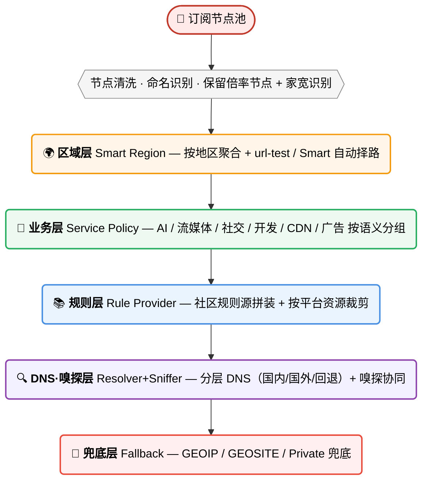
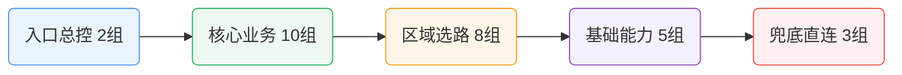
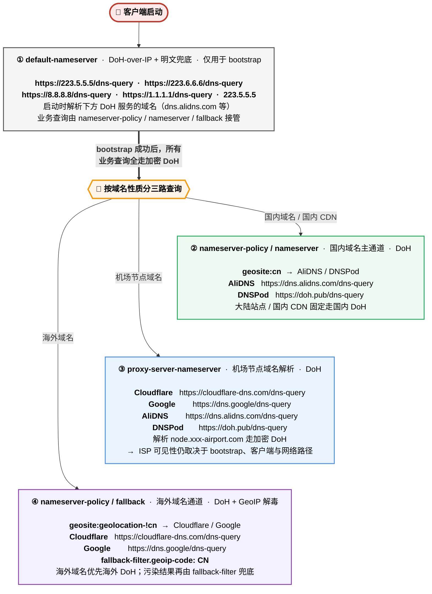

# 🚀 Smart-Config-Kit v6.0.9

> 一套以 `rulesets/source/routing-graph.js` 为唯一规则源、同步产出 14 种客户端配置的跨端智能分流体系，覆盖 Windows / macOS / Linux / Android / iOS / OpenWrt。
>
> - 🧭 同一 source graph 经 `MRS -> fused -> 原生产物` 生成各端配置，统一规则顺序与分流目标。
> - 🎯 国内策略优先，关键域名、API 和本地工具按明确策略分流；各内核使用适合自身能力的规则格式。
> - 🧩 22 个区域组 + 33 个业务组，提供 Smart / Normal 两种内核。
> - 🛡️ 分层 DoH 负责业务 DNS；支持订阅覆写的 Mihomo 入口只投影活动节点所需的 DNS 提示，静态端边界见 [DNS 指南](./docs/private-node-dns.md)。
> - 🔄 GitHub Actions 自动重建、校验和发布产物，减少跨端配置漂移。
>
> ⚠️ Mihomo 内核由本人实测，其他内核请自行验证后使用

💖 [支持本项目](./docs/donate.md) · ⭐ [Star](https://github.com/ivansolis1989/Smart-Config-Kit) · 🐛 [Issue](https://github.com/ivansolis1989/Smart-Config-Kit/issues)

---

## ✅ 该用哪个产物

| 使用场景 | 推荐入口 | 说明 |
|---|---|---|
| Clash Party / Mihomo Smart | `Clash Party/ClashParty(mihomo-smart).js` | Smart 内核 + LightGBM 择路；消费最终融合规则集 |
| Clash Party 普通内核 / FlClash | `Clash Party/ClashParty(mihomo).js` / `FlClash/FlClash(mihomo).js` | 同规则语义，区域组选 `url-test` |
| Android Mihomo | `Clash Meta For Android/CMFA(mihomo).yaml` | CMFA 是同步产物，不是规则基准 |
| Stash | `Stash/Stash.yaml` | 从 CMFA 自动裁剪生成，保持 Clash Premium 兼容 |
| sing-box / Hiddify / HomeProxy | `SingBox/SingBox(sing-box)-full.json` | 使用 `.srs` 融合规则集 |
| v2rayN Xray | `v2rayN/v2rayN(xray).json` | 从 66 个非空 fused sing-box JSON 展平成 86 条 Xray RuleObject |
| iOS / macOS 其他客户端 | `Egern/`、`Shadowrocket/`、`Surge/`、`Loon/`、`Quantumult X/` | 按各 APP 原生语法同步 |
| OpenWrt | 优先 `OpenClash/`，Passwall / Passwall2 作为降级参考 | Passwall 系使用 66 条非空 fused `.srs` shunt rule |

---

## 🧭 分流策略设计框架（重点）

每一层只做一件事，上层稳定下层就稳定——订阅换了、机场改了、规则上游变了，只影响**对应那一层**，不会全链路翻车。

---

## 🧩 Smart 分流规则：33 业务组速览（含 14 流媒体平台组）

为了让结构更清晰，下面用”**分层卡片 + 关系图**”展示 33 个业务代理组，而不是单一大表。

### 🗂️ 代理组与主要 Rule-Providers 对照（source graph 输入）

> 这张表不是最终配置中的 `rule-providers` 清单。最终产物不再直接调用这些上游规则集；它们只作为 `rulesets/source/routing-graph.js` 的源图输入，经 `tools/build-fused-rule-sets.js` 按最终分流目标、规则顺序和平台能力编译为 `rulesets/generated/fused/**/scki-fused-*`。
> 只列“主要/高频命中”输入项，并标明来源仓库；节点组（HK/US/全球节点等）不混入本表。

编译器必须同时满足四个不变量：不透明 `.mrs` 只能映射到同源文本（例如 HaGeZi Ultimate 不能替换成完整 TIF）；去重不得跨策略段；国家 GEOIP 优先原生查询；任何远程源解析失败、非法残余规则或客户端聚合预算超限都直接让构建失败，禁止静默回退生成部分产物。

| 代理组（最终目标） | source graph 主要输入（示例，非最终调用） | 主要来源仓库 / 来源类型 |
|---|---|---|
| 🤖 AI 服务 | `openai` `claude` `gemini` `copilot` `szkane-ai` `acc-copilot` `vpsdance-ai-coding` | MetaCubeX / blackmatrix7 / szkane / Accademia / VPSDance |
| 💰 加密货币 | `cryptocurrency` `binance` `szkane-web3` | blackmatrix7 / szkane |
| 🏦 金融支付 | `paypal` `stripe` `paddle.com` `visa` `tigerfintech` `acc-bank-*` `acc-vf-*` | blackmatrix7 / Accademia / SCKI supplemental / 本地误伤白名单 |
| 💬 即时通讯 | `telegram` `telegram-ip` `discord` `whatsapp` `line` `kakaotalk` `kakaotalk.com` `acc-signal` | MetaCubeX / blackmatrix7 / Accademia / SCKI supplemental |
| 📱 社交媒体 | `twitter` `twitter-ip` `tiktok` `facebook` `instagram` `snapchat` `reddit` | MetaCubeX / blackmatrix7 |
| 🧑‍💼 会议协作 | `zoom` `slack` `teams` `atlassian` `notion` `remotedesktop` `acc-rustdesk` `rustdesk.com` | ACL4SSR / blackmatrix7 / Accademia / SCKI supplemental |
| 📺 国内流媒体 | `bilibili` `iqiyi` `youku` `tencentvideo` `douyin` `zjcdn.com` `neteasemusic` | blackmatrix7 / SCKI supplemental / 本地前置守卫 |
| 🎵 TikTok | `tiktok` | MetaCubeX |
| 🎥 Netflix | `netflix` `netflix-ip` `szkane-netflixip` | MetaCubeX / szkane |
| 🎬 Disney+ | `disney` | blackmatrix7 |
| 📡 HBO/Max | `hbo` | blackmatrix7 |
| 📺 Hulu | `hulu` | blackmatrix7 |
| 🎬 Prime Video | `primevideo` `amazon` | blackmatrix7 |
| 📹 YouTube | `youtube` | MetaCubeX |
| 🎵 音乐流媒体 | `spotify` `tidal` `deezer` `soundcloud` `pandora` `lastfm` `qobuz` `overcast` | blackmatrix7 |
| 🇭🇰 香港流媒体 | `mytvsuper` `tvb` `nowe` `rthk` `szkane-bilihmt` | blackmatrix7 / szkane |
| 🇹🇼 台湾流媒体 | `bahamut` `kktv` `litv` `hamivideo` `linetv` `friday` | blackmatrix7 |
| 🇯🇵 日韩流媒体 | `abema` `dazn` `dmm` `tver` `niconico` `rakuten` | blackmatrix7 |
| 🇪🇺 欧洲流媒体 | `bbc` `itv` `all4` `my5` `skygo` `britboxuk` `szkane-uk` | MetaCubeX / blackmatrix7 / szkane |
| 🌐 其他国外流媒体 | `viu` `biliintl` `iqiyiintl` `wetv` `viki` `paramount` `peacock` `twitch` `vimeo` `dailymotion` `acc-kwai` | blackmatrix7 / Accademia |
| 🕹️ 国内游戏 | `mihoyo/yuanshen` `netease` `wegame` `steamcn` `majsoul` `battlenet.com.cn` | 本地前置 + blackmatrix7 / SCKI supplemental |
| 🎮 国外游戏 | `steam` `epic` `playstation` `xbox` `riot` `ea` `hoyoverse` | blackmatrix7（宽规则在国内游戏之后） |
| 🔍 Google 服务 | `google` `google-ip` `scholar`（Apple 端另含 `GoogleSearch` `GoogleDrive` `GoogleEarth`） | MetaCubeX / blackmatrix7 |
| 🔧 工具与服务 | `bing` `yandex` `github` `docker` `gitlab` `python` `developer` `szkane-developer` | blackmatrix7 / szkane |
| Ⓜ️ 微软服务 | `onedrive` `microsoft` `microsoftedge` `acc-microsoftapps` | blackmatrix7 / Accademia |
| 🍎 苹果服务 | `apple` `icloud` `appstore` `appletv` `applemusic` `acc-apple` `acc-applenews` | blackmatrix7 / Accademia |
| 📥 下载更新 | `googlefcm` `systemota` `download` `ubuntu` `mozilla` `android` `acc-macappupgrade` | blackmatrix7 / Accademia |
| 🛰️ BT/PT Tracker | `privatetracker` `acc-emuleserver` | blackmatrix7 / Accademia |
| 🏠 国内网站 | `amap` / `GaoDe` `cn` `cn-ip` `acc-chinamax` `acc-geo-d-asia-china` | MetaCubeX / blackmatrix7 / Accademia |
| 🚫 受限网站 | `loyalsoldier-gfw` `loyalsoldier-greatfire` `GEOSITE,gfw` `szkane-proxygfw` | Loyalsoldier / MetaCubeX / szkane |
| 🌐 国外网站 | `proxy` `cnn` `nytimes` `bloomberg` `ebay` `wikipedia` `acc-waybackmachine` `mail` `protonmail` `cloudflare` `fastly` `akamai` | blackmatrix7 / Accademia / szkane / MetaCubeX |
| 🐟 漏网之鱼 | `MATCH` / `FINAL`，以及平台原生兜底能力 | 内核兜底（非固定 provider） |
| 🛑 广告拦截 | `anti-ad` `sukka-phishing` `hagezi-tif` `advertising` `privacy` `GEOSITE,category-ads-all` `acc-unsupportvpn` | DustinWin / SukkaW / Hagezi / blackmatrix7 / MetaCubeX / Accademia |

最终编译输出按平台分发：

- Mihomo / CMFA / OpenClash / FlClash / Stash：`scki-fused-*-domain.mrs`、`scki-fused-*-ipcidr.mrs`、`scki-fused-*-residual.yaml`
- Shadowrocket / Surge / Loon / Quantumult X / Egern：`rulesets/generated/fused/<platform>/scki-fused-*`
- sing-box / Hiddify / HomeProxy：`rulesets/generated/fused/sing-box/scki-fused-*.srs`
- v2rayN Xray：由 fused sing-box JSON 展平成 Xray `RuleObject`
- Passwall / Passwall2：65 条 `rule-set:remote` fused `.srs` shunt rule

---

## 🎯 差异化价值：source graph + fused compiler，而不是堆上游

> GeoIP / GeoSite / MMDB / ASN 仍是底层数据库和少量运行时原语，但不再是最终分流框架主干。普通业务分类可以作为 source graph 输入；最终客户端产物应消费 `scki-fused-*`，只保留端口、逻辑组合、`MATCH/FINAL`、DNS policy、private/geo 兜底等无法安全折叠的少量内联规则。
>
> 覆盖审查流程见 [docs/GEOSITE_COVERAGE_LEDGER.md](./docs/GEOSITE_COVERAGE_LEDGER.md)。

| 类型 | 原生 geosite / geoip 的边界 | 本仓库的补法 | 典型例子 |
|---|---|---|---|
| **① 新兴服务** | 新 AI / Web3 / 开发工具上线后通常滞后收录 | `szkane-ai` / `vpsdance-ai-coding` / `acc-grok` / SCKI supplemental 进入 source graph，再编译成 fused | cursor.com · zed.dev · windsurf.com · openrouter.ai |
| **② 子类拆分** | `geosite:apple` / `geosite:google` 是粗分类，无法表达 AppStore 直连、Google 工作流代理等细分决策 | blackmatrix7 / Accademia / SCKI supplemental 拆成子服务输入，再按最终业务组融合 | Apple / Google / Microsoft 家族各子服务独立决策 |
| **③ 安全纵深** | `category-ads-all` 不能覆盖钓鱼、恶意软件、SDK 埋点、DNS 劫持等完整风险面 | anti-AD / Sukka / Hagezi / bm7 / Accademia 多源合并到 `🛑 广告拦截` fused 产物 | anti-AD + sukka-phishing + hagezi-tif |
| **④ 地区长尾** | 国际社区不稳定维护中国特有 SDK、港澳台细分、IoT / 支付 / 本土 CDN 长尾 | szkane / Accademia / SCKI supplemental 补齐后进入 fused 输出 | B 站港澳台版 · 绿米 IoT · 本土金融支付域名 |
| **⑤ 跨端一致性** | 不同客户端对 GEOSITE/GEOIP/ASN 支持差异大，直接散写会造成端间漂移 | 同一 source graph 编译为 `.mrs` / `.srs` / Apple 文本规则 / Egern YAML / Xray RuleObject / Passwall shunt | v2rayN Xray 与 Passwall 不再维护手写 33 组降级表 |

> **加法原则**：和原生 geosite >95% 重叠且没有顺序、平台或误伤收益 → 拒绝加入或删除；Geo 数据库保留为基础设施，普通分类沉淀到 fused 输出。

---

## 🛡️ DNS 净化

> 分流规则配得再好，DNS 漏了照样白搭。仓库用分层 DNS 管理 bootstrap、国内域名、机场节点和海外域名查询，业务请求优先走加密 DoH。

### 私有节点 DNS：受限适配边界

Clash Party Smart/Normal、FlClash 覆写和 OpenClash Normal/Smart 在订阅导入时，只投影**活动代理节点 FQDN**所需的 private resolver、精确 node policy 与 bootstrap hosts；默认 `adaptive`，受信任本地可选 `off / policy / adaptive`。三档都不改变 55 组、规则或全局业务 DNS，`fake-ip`、`nameserver` / `fallback` 和仓库 hosts 仍由本仓库基线管理。

CMFA、Stash、Egern、Apple 配置、sing-box、v2rayN Xray、Passwall / Passwall2 是静态或路由产物，不自动读取机场 DNS。IPv6 bootstrap、通配符物化、静态端 Mixin、验证方法和“不保证零泄漏”的边界见 [私有节点 DNS 指南](./docs/private-node-dns.md)；各端能力见[跨客户端能力矩阵](./docs/client-capability-matrix.md)。

### 本仓库的 DNS 四层分工

> 完整 YAML + 验证命令 + 各端 DNS 内置状态表，见 `Clash Party/README.md` 第四章；订阅私有节点 DNS 的受限投影和静态端边界见 [docs/private-node-dns.md](./docs/private-node-dns.md)。

---

## ✅ 导入后 60 秒验证清单

导入任一端产物后，先看这 6 件事，能快速判断是配置问题、规则下载问题，还是节点质量问题。

1. **节点与策略组存在**：Mihomo / Stash / Apple 系客户端应看到 22 区域组 + 33 业务组；sing-box Full 应看到 54 个出站；v2rayN Xray / Passwall 系没有业务策略组是正常限制。
2. **规则源下载完成**：Clash / OpenClash / CMFA / FlClash / Stash 里 `rule-providers` 不应有大面积 403 / 404；Surge / Loon / QX / Egern 看远程规则列表是否下载成功；sing-box 和 Passwall 系看 fused `.srs` 是否全部可用。
3. **广告误伤安全阀生效**：访问或规则测试 `paddle.com` 应命中 `🏦 金融支付`，`cloudflarestorage.com` 应命中 `🌐 国外网站`，都不是 `🛑 广告拦截`；小米账号/云服务域名应走 `DIRECT`。
4. **GEOSITE 基础命中正常**：`geosite:private` / 局域网应直连，`geosite:gfw` 应进入 `🚫 受限网站`，`geosite:category-ads-all` 应进入广告拦截。
5. **DNS 没泄漏**：按上方 DNS 检查确认只看到预期 DoH 上游，不应看到本地 ISP DNS。
6. **最终兜底可解释**：连接日志里落到 `🐟 漏网之鱼` 的域名要能解释；如果某个新服务长期落入 FINAL，再按 [GEOSITE 覆盖台账](./docs/GEOSITE_COVERAGE_LEDGER.md) 判断是否补 provider。

---

## 🔌 各端协议支持 + 快速导入速查

一张表搞定："**机场给什么协议 → 选哪个端 → 去哪看教程**"。列名缩写 + 具体配置文件 → 见表下方。

| 协议 | Clash Party | CMFA | Stash | Open Clash | Shadow rocket | Surge | Loon | QX | sing- box | v2rayN Xray | v2rayN mihomo |
|---|:-:|:-:|:-:|:-:|:-:|:-:|:-:|:-:|:-:|:-:|:-:|
| **SS (+ 2022)** | ✅ | ✅ | ✅ | ✅ | ✅ | ✅ | ✅ | ✅ | ✅ | ✅ | ✅ |
| **SSR** | ✅ | ✅ | ✅ | ✅ | ✅ | ❌ | ✅ | ✅ | ❌ | ❌ | ✅¹ |
| **VMess** | ✅ | ✅ | ✅ | ✅ | ✅ | ✅ | ✅ | ✅ | ✅ | ✅ | ✅ |
| **VLESS** | ✅ | ✅ | ✅ | ✅ | ✅ | ❌ | ✅ | ⚠️ | ✅ | ✅ | ✅ |
| **REALITY + Vision** | ✅ | ✅ | ✅ | ✅ | ✅ | ❌ | ✅ | ⚠️ | ✅ | ✅ | ✅ |
| **Trojan** | ✅ | ✅ | ✅ | ✅ | ✅ | ✅ | ✅ | ✅ | ✅ | ✅ | ✅ |
| **Hysteria 1** | ✅ | ✅ | ✅ | ✅ | ✅ | ❌ | ✅ | ❌ | ✅ | ❌ | ✅ |
| **Hysteria 2** | ✅ | ✅ | ✅ | ✅ | ✅ | ⚠️² | ✅ | ❌ | ✅ | ❌ | ✅ |
| **TUIC v5** | ✅ | ✅ | ✅ | ✅ | ✅ | ❌ | ✅ | ❌ | ✅ | ❌ | ✅ |
| **WireGuard** | ✅ | ✅ | ✅ | ✅ | ✅ | ✅ | ✅ | ❌ | ✅ | ⚠️ | ✅ |
| **AnyTLS** | ✅ | ✅ | ✅ | ✅ | ✅ | ❌ | ⚠️ | ✅ | ✅ | ❌ | ✅ |
| **ShadowTLS** | ✅ | ✅ | ✅ | ✅ | ✅ | ❌ | ⚠️ | ❌ | ✅ | ❌ | ✅ |
| **Snell v4** | ✅ | ✅ | ⚠️⁴ | ✅ | ✅ | ✅ | ✅ | ❌ | ❌ | ❌ | ✅¹ |
| **Mieru** | ✅ | ✅ | ❌ | ✅ | ⚠️ | ❌ | ❌ | ❌ | ❌ | ❌ | ✅¹ |
| **SSH 出站** | ✅ | ✅ | ✅ | ✅ | ❌ | ❌ | ❌ | ❌ | ✅ | ❌ | ✅ |
| **HTTP / SOCKS5** | ✅ | ✅ | ✅ | ✅ | ✅ | ✅ | ✅ | ✅ | ✅ | ✅ | ✅ |
| **LightGBM 自动择优** | ✅³ | ❌ | ❌ | ✅ | ❌ | ❌ | ❌ | ❌ | ❌ | ❌ | ❌ |
| **📖 子目录** | [Clash Party](./Clash%20Party/) | [CMFA](./Clash%20Meta%20For%20Android/) | [Stash](./Stash/) | [OpenClash](./OpenClash/) | [Shadow rocket](./Shadowrocket/) | [Surge](./Surge/) | [Loon](./Loon/) | [QX](./Quantumult%20X/) | [SingBox](./SingBox/) | [v2rayN](./v2rayN/) | [v2rayN](./v2rayN/) |

> ✅ 原生支持 · ⚠️ 部分 / 新版本才有 · ❌ 不支持
> ¹ 需 v2rayN 切到 mihomo 核心 · ² Surge 5.9+ 才有 · ³ 需 mihomo Smart Alpha + JS 覆写 · ⁴ Stash Wiki 当前 Snell 示例为 v3；v4 需以 App 实测为准

**🏷️ 缩写速查**：Clash Party = Clash Party / Clash Verge Rev / Mihomo Party · CMFA = Clash Meta For Android（含 [ClashMi](https://github.com/KaringX/clashmi)）· Stash = Clash Premium 兼容 iOS / macOS / tvOS 客户端 · FlClash = 跨平台 Flutter GUI · QX = Quantumult X · sing-box = SFA / SFM / SFI / Hiddify / Karing / HomeProxy · v2rayN Xray = v2rayN 默认核 · v2rayN mihomo = v2rayN 切 mihomo/sing-box 核

**📁 配置文件**：每个子目录的 `README.md` 内有完整说明，点击上方 📖 列进入。

**💡 选客户端**：常用协议（SS / VMess / Trojan）→ 按设备挑；VLESS + REALITY → Mihomo / sing-box / SR / Loon / v2rayN；Hysteria 2 / TUIC → 避开 Surge 旧版 / QX / Xray；想要 **LightGBM 自动择优** → 只能走 Clash Party / OpenClash + Smart Alpha 内核。

**🔌 软路由 / Apple 端**：ShellClash（mihomo 核）→ 用 CMFA YAML · HomeProxy（sing-box 核）→ 用 SingBox JSON · Stash → 用 Stash YAML · Egern → 用 `Egern/Egern.yaml` · Passwall / Passwall2（无 mihomo）→ 首选迁移到 OpenClash，或用 `Passwall/` / `Passwall2/` fused shunt rule fallback · SSR Plus+（已停更）→ 换 OpenClash · Happ（Xray 核）→ 用 v2rayN Xray JSON。详见各子目录 `README.md`。

---

## 📌 适用人群

- 想“一套配置跑多端”的用户；
- 不想手工维护大量策略组但又追求精细分流的用户；
- 希望借助 AI 持续优化配置工程质量的用户。

---

## 🙏 致谢

本仓库做**编排、覆写、适配**，真正的重活靠这些项目：

**🧠 内核**：[mihomo](https://github.com/MetaCubeX/mihomo) / [Smart Alpha](https://github.com/MetaCubeX/mihomo/tree/Alpha) / [LightGBM](https://github.com/vernesong/mihomo/releases/download/LightGBM-Model/Model.bin) / [sing-box](https://github.com/SagerNet/sing-box) / [Xray](https://github.com/XTLS/Xray-core) / [hiddify-sing-box](https://github.com/hiddify/hiddify-sing-box)

**📱 客户端**：[mihomo-party](https://github.com/mihomo-party-org/mihomo-party) / [Verge Rev](https://github.com/clash-verge-rev/clash-verge-rev) / [CMFA](https://github.com/MetaCubeX/ClashMetaForAndroid) / [Stash](https://stash.wiki/) / [FlClash](https://github.com/chen08209/FlClash) / [OpenClash](https://github.com/vernesong/OpenClash) / [HomeProxy](https://github.com/immortalwrt/homeproxy) / [ShellCrash](https://github.com/juewuy/ShellCrash) / [Passwall2](https://github.com/Openwrt-Passwall/openwrt-passwall2) / [v2rayN](https://github.com/2dust/v2rayN) / [Hiddify](https://github.com/hiddify/hiddify-app)

**📚 规则库**：[geosite](https://github.com/MetaCubeX/meta-rules-dat) / [geoip](https://github.com/Loyalsoldier/geoip) / [clash-rules](https://github.com/Loyalsoldier/clash-rules) / [v2ray-rules-dat](https://github.com/Loyalsoldier/v2ray-rules-dat)

**📦 规则集**：[bm7](https://github.com/blackmatrix7/ios_rule_script) / [Accademia](https://github.com/Accademia/Additional_Rule_For_Clash) / [DustinWin](https://github.com/DustinWin/ruleset_geodata) / [ACL4SSR](https://github.com/ACL4SSR/ACL4SSR) / [SukkaW](https://github.com/SukkaW/Surge) / [Hagezi](https://github.com/hagezi/dns-blocklists) / [MiHomo-Hagezi](https://github.com/MiHomoer/MiHomo-Hagezi) / [szkane](https://github.com/szkane/Rules) / [VPSDance AI Rules](https://github.com/VPSDance/ai-proxy-rules) / [anti-AD](https://github.com/privacy-protection-tools/anti-AD)

**🛠️ 工具**：[Sub-Store](https://github.com/sub-store-org/Sub-Store) / [PROCESS-NAME 兼容清单](./docs/process-name-compatibility.md) / [QX 脚本](https://github.com/KOP-XIAO/QuantumultX) / [Qure 图标](https://github.com/Koolson/Qure) / [domain-list-community](https://github.com/v2fly/domain-list-community)

**💳 闭源客户端**：[Shadowrocket](https://apps.apple.com/app/shadowrocket/id932747118) / [Stash](https://apps.apple.com/app/stash-rule-based-proxy/id1596063349) / [Surge](https://nssurge.com/) / [Loon](https://apps.apple.com/app/loon/id1373567447) / [Quantumult X](https://apps.apple.com/app/quantumult-x/id1443988620) / [Egern](https://egernapp.com/)

> 遗漏了你的项目？欢迎 [开 Issue](https://github.com/ivansolis1989/Smart-Config-Kit/issues) 指出——**所有真正做事的人都值得被点名**。

---

## 💖 支持本项目

→ [捐赠 / Star / PR](./docs/donate.md)

---

## 📄 免责声明

本仓库是一个**纯技术学习项目**——记录一套代理分流策略在不同客户端上的等价实现，帮助开发者理解各代理引擎的配置语法差异。仓库不提供任何节点、订阅或翻墙服务。

- 所有配置文件仅供**个人技术研究与学习**，请勿用于违反所在地法律法规的用途。
- 使用前请确认符合当地法律，风险自担。
- 本项目不鼓励也不协助任何形式的违规传播。

---

## 📄 License

默认采用 **MIT License**。第三方规则与数据资产遵循其各自许可证。
