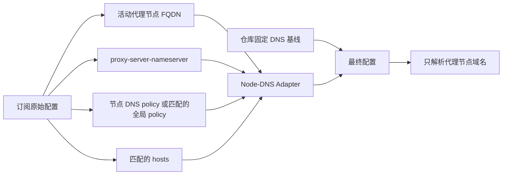

# 私有节点 DNS：受限投影与跨端边界

> 本文只讨论“代理节点域名如何解析”。业务域名的 `nameserver`、`fallback`、fake-ip 与分流规则仍由各客户端产物的固定 DNS 基线负责。

## 结论

订阅里的私有 DNS 不能整段照搬：它可能替换全局业务 DNS、携带路由后缀，或把无关的 hosts 注入最终配置。本仓库把它收敛为一个小而明确的运行时 Module：**只为当前订阅中实际启用的代理节点 FQDN，投影解析这些节点所必需的 resolver、policy 和 bootstrap hosts。**



这个 Adapter 是运行时的 **Module**；`tools/runtime/node-dns-hints.js` 和 `.rb` 是唯一权威源，桌面 JS 与 OpenClash Ruby 只是同步后的 **Adapter**。其窄 Interface 是 `captureNodeDns(source, activeServers, profile) → snapshot` 与 `applyNodeDns(repository, snapshot, profile) → report`：前者只读取订阅，后者只在仓库 DNS 基线已存在时写入。`apply` 还会复核 snapshot 的内部闭包：policy key 必须列在 snapshot 的活动节点域名中，hosts 只能属于该 policy 或其 resolver hostname 的闭包；任何越界、畸形或 profile 不一致的 snapshot 都零写入。生产 Adapter 只传递同次 `capture` 产物。这样订阅解析逻辑有单一职责和清晰的信任边界，而不是把同一段启发式代码散落在五处。

## 可选功能 profile

profile 的唯一源是 `tools/runtime/subscription-adapter-profiles.json`，发布默认值为 `adaptive`。它是**受信任的本地设置**，绝不从机场订阅字段读取；无论选择哪档，`routing-graph.js`、55 个策略组、规则、rule-provider、全局 `nameserver` / `fallback` / fake-ip 与固定 `proxy-server-nameserver` 都不变。

| profile | 订阅 DNS 投影 | 适用场景 |
|---|---|---|
| `off` | 不读取或写入任何订阅 Node-DNS hint。 | 机场节点域名完全可由仓库固定 DNS 基线解析。 |
| `policy` | 只把活动节点命中的 `proxy-server-nameserver-policy` 或 `nameserver-policy` 物化为精确 policy。 | 只信任订阅明确声明的节点 policy。 |
| `adaptive`（默认） | 在 `policy` 的基础上，允许经过校验的订阅 `proxy-server-nameserver` 作为**没有匹配 policy 的活动节点**回退。 | 私有 resolver 仅在订阅未写精确 policy 时仍需工作。 |

仓库维护者如需改变发布默认值，应修改该 JSON 的 `default`，然后运行 `node tools/sync-node-dns-hints-adapters.js`；同步器会同时更新三份 JS 和两份 OpenClash 适配器。部署时可以在受信任的本地副本选择 `off / policy / adaptive`，但不要把 profile 写进机场 YAML，也不要用它删除策略组或改写全局 DNS。

## 输入、输出与拒绝规则

| 订阅输入 | Adapter 行为 |
|---|---|
| `proxies[].server` | 仅保留活动、非信息节点的合法 FQDN；IP 节点不需要 DNS，直接忽略。 |
| `dns.proxy-server-nameserver` | 仅 `adaptive` 档读取；校验后只作为“没有更具体 policy 的活动节点”的精确 policy 值。固定 `proxy-server-nameserver` 全局列表不变。不会读取普通 `nameserver` 或 `fallback`。 |
| `dns.proxy-server-nameserver-policy` | 精确匹配优先；通配符只会为活动节点物化成精确 FQDN，不会整段带入。 |
| `dns.nameserver-policy` | 仅当对应节点没有 `proxy-server-nameserver-policy` 时，才作为该节点的兼容性回退；同样只物化精确 FQDN。 |
| `hosts` | 只取节点自身和已接受 resolver hostname 的匹配记录。固定基线 hosts 优先，不会被订阅替换。 |

以下值会被丢弃：`system` / `dhcp` / `rcode:`，含 `#` 路由后缀的 resolver，`skip-cert-verify`、`ecs`、`h3` 参数，畸形域名、无效 IP、过长输入和超过上限的条目。hosts 的单个域名重定向保留为标量，IP 才使用数组，符合 [Mihomo hosts](https://wiki.metacubex.one/en/config/dns/hosts/) 语义。输入上限为 512 个 proxy、128 个节点、64 个 resolver / policy / hosts 输出；每个 policy/hosts 源 map 的通配符扫描上限为 256 项，活动节点的大小写无关精确 key 额外有 4096 项有界扫描。resolver hostname 的 hosts 优先于节点 hosts 收集；一条 policy 所需 resolver 超过容量会整体拒绝，不留下无法 bootstrap 的半条 policy。日志只输出数量，不输出节点域名、DNS 地址或 bootstrap IP。

`proxy-server-nameserver` 与 `proxy-server-nameserver-policy` 本来就只负责代理节点域名；后者还要求前者非空才生效。`default-nameserver` 则用来解析 DNS endpoint 自身，其 endpoint host 必须是 IP。语义依据见 [Mihomo DNS 配置](https://wiki.metacubex.one/en/config/dns/) 和 [域名通配符语法](https://wiki.metacubex.one/en/handbook/syntax/)。

## 通配符如何处理

源订阅可以使用 Mihomo 的 `+.`、`.` 或 `*.`。Adapter 按官方语义匹配后，只生成如 `hk.node.example` 的精确 key：

- `+.node.example`：`node.example` 与所有子域；
- `.node.example`：仅子域，不含根域；
- `*.node.example`：恰好一层 label。

同一优先级出现冲突 resolver 时，Adapter 失败关闭该项，而不是随机选择；resolver URL 的 path/query 保持大小写，不会被错误地合并。这样通配符不会扩大最终私有 DNS 的影响面。

## 哪些端可以自动适配

| 产物 / 入口 | 状态 | 原因 |
|---|---|---|
| Clash Party Smart | 自动 | JS 覆写有订阅配置输入。 |
| Clash Party Normal | 自动 | 同上。 |
| FlClash 覆写脚本 | 自动，有应用层前提 | 关联 JS 后关闭「DNS 覆写」，避免 UI 二次覆盖节点 DNS 投影；核对最终配置，见 [FlClash 教程](../FlClash/README.md)。 |
| OpenClash Normal / Smart | 自动 | 覆写 Ruby 在写入本地配置前可读取原订阅。 |
| CMFA / Stash / Egern | 本地 overlay | 静态 YAML（Stash/Egern 还是生成物，禁止手改生成文件），没有订阅运行时变换 seam。 |
| Shadowrocket / Surge / Loon / Quantumult X | 本地配置 | 仓库交付的是静态私有配置，不能读取机场源 YAML。 |
| Sing-box / Hiddify / HomeProxy | 本地配置 | 仓库交付的是静态 sing-box JSON，不是订阅 DNS 转换器。 |
| v2rayN Xray | 不适用 | 这里的 JSON 只提供 Xray 路由 fallback。 |
| Passwall / Passwall2 | 不适用 | 这里的产物是 shunt rule/UCI 参考，不拥有 Mihomo DNS runtime。 |

上表是 Node-DNS 的快速边界；完整的 14 个产品还应结合订阅输入、动态分组和可选 profile 一起判断，见[跨客户端能力矩阵](./client-capability-matrix.md)。矩阵把“客户端可导入订阅”和“本仓库拥有运行时订阅适配 hook”明确区分，避免把静态配置端误称为自动适配。

ShellClash、ClashMi 等复用入口也不会因为复用了本仓库配置而自动获得该能力；只有它们提供等价的订阅覆写 hook 时，才可以单独实现 Adapter。

## 静态端的手动 overlay 示例

如果你的节点必须由私有 resolver 解析，请在**该客户端自己的本地配置 / Mixin**里合并下列概念，替换占位符，不要覆盖仓库的全部 DNS 基线：

```yaml
hosts:
  resolver.example:
    - 203.0.113.53       # 仅示例；填私有 resolver 的可信 bootstrap IP
    - "2001:db8::53"

dns:
  proxy-server-nameserver:
    - https://resolver.example/dns-query
  proxy-server-nameserver-policy:
    proxy-node.example:
      - https://resolver.example/dns-query
```

若 `resolver.example` 不是已能通过可信 bootstrap 解析的域名，需要 hosts 映射或客户端本地、IP 形式的 `default-nameserver`；不要让 resolver endpoint 依赖它自己解析。此示例只适用于支持相同 Mihomo DNS 字段的客户端；Apple 私有配置、sing-box、Passwall 等应使用各自原生字段，不可直接粘贴。

## 验证与排障

1. 刷新订阅后，查看最终配置：只有实际节点 FQDN 能出现在 `proxy-server-nameserver-policy`；不应出现 `geosite:`、`rule-set:` 或无关域名。
2. 检查 `proxy-server-nameserver`：它应保持仓库固定基线；私有 resolver 只会出现在对应活动节点的精确 `proxy-server-nameserver-policy` 中。
3. 如私有 resolver hostname 无法启动，先核对其 bootstrap IP / hosts，而不是把整个订阅 `nameserver` 覆盖进来。
4. 如日志显示 `profile-mismatch` 或 `missing-pss-baseline`，Adapter 会零写入；前者表示 capture/apply 的受信任 profile 不一致，后者表示调用方没有先写入仓库固定 PSS 基线。
5. 维护者可运行：

   ```bash
   node tools/sync-node-dns-hints-adapters.js --check
   node tools/validate-js-overwrites.js
   node tools/test-openclash-node-dns-hints.js
   node tools/generate-client-capability-matrix.js --check
   ```

这层隔离减少的是“订阅 DNS 改写业务 DNS”的风险，不是对所有 DNS 泄漏的绝对承诺。系统 DNS、客户端绕过、TUN/VPN 开关、resolver 的网络路径和 endpoint 的 TLS 信任仍需分别验证。
